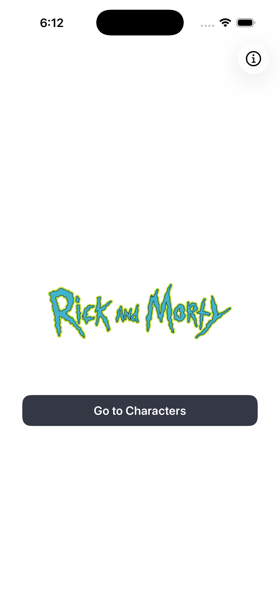
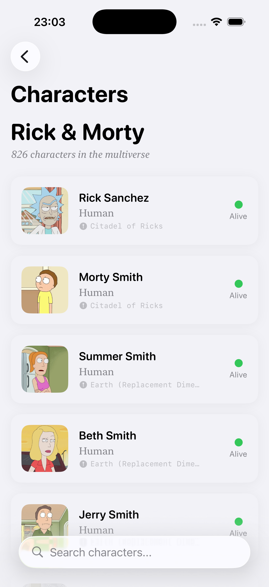
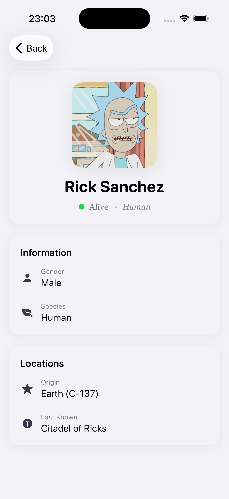

# Challenge

> **Technical Challenge**: This project is a technical challenge designed to validate code quality, architectural patterns, and best practices in iOS development.

iOS application built with **Swift 6**, **SwiftUI**, **Clean Architecture**, and **SOLID principles**. Designed with best practices to ensure code that is **scalable**, **readable**, and **testable**.

## Screenshots

| Home | Character List | Character Detail |
|:----:|:--------------:|:----------------:|
|  |  |  |

## Requirements

| Tool | Version |
|------|---------|
| Xcode | 26+ |
| iOS | 17.0+ |
| Swift | 6.2 |
| macOS | Sequoia 15.6+ |

## Quick Start

### 1. Initial Setup

Run the setup script to install all required tools:

```bash
./setup.sh
```

### 2. Build the Project

Generate the Xcode project and install dependencies:

```bash
./generate.sh
```

## Architecture

The project follows **MVVM + Clean Architecture** with feature-based modularization. See [Architecture Documentation](docs/Architecture.md) for details.

## Project Structure

See [Project Structure Documentation](docs/ProjectStructure.md) for directory layout and dependency graph.

### Libraries (Horizontal)

Shared infrastructure modules, agnostic to business logic:

| Module | Description |
|--------|-------------|
| **ChallengeCore** | Navigation, routing, deep linking, image loading |
| **ChallengeNetworking** | HTTP client abstraction over URLSession |
| **ChallengeDesignSystem** | Atomic Design UI components and design tokens |
| **ChallengeResources** | Localization and shared assets |

### Features (Vertical)

Self-contained modules with Presentation, Domain, and Data layers:

| Module | Description |
|--------|-------------|
| **ChallengeCharacter** | Character list and detail screens (Rick & Morty API) |
| **ChallengeHome** | Home screen with animated logo |
| **ChallengeSystem** | System settings and configuration |

### Composition

| Module | Description |
|--------|-------------|
| **ChallengeAppKit** | Dependency injection, root navigation, feature wiring |

## Testing

Uses Swift Testing for unit tests, SnapshotTesting for visual regression, and XCTest for UI tests. Tests run serially as parallelization was benchmarked and found to be ~49% slower at the current test suite size. The project achieves **100% code coverage**. See [Testing Documentation](docs/Testing.md) for details.


## Continuous Integration

The project uses GitHub Actions to run quality checks on every pull request. See [CI Documentation](docs/CI.md) for details.

| Test Failure | Periphery |
|:------------:|:---------:|
|  |  |

## Deep Linking

The app supports URL-based deep links with the `challenge://` scheme. See [Deep Linking Documentation](docs/DeepLinking.md) for available routes and terminal usage.

## Tools & Dependencies

### Tools (mise)

This project uses [mise](https://mise.jdx.dev/) as a tool version manager. All tool versions are defined in `.mise.toml`:

| Tool | Version | Description |
|------|---------|-------------|
| [Tuist](https://tuist.io/) | 4.129.0 | Xcode project generation and dependency management |
| [SwiftLint](https://github.com/realm/SwiftLint) | 0.63.1 | Swift style and conventions linter |
| [Periphery](https://github.com/peripheryapp/periphery) | 3.4.0 | Dead code detection for Swift |

See [Tuist Documentation](docs/Tuist.md) and [Scripts Documentation](docs/Scripts.md) for more details.

### External Dependencies

| Package | Purpose |
|---------|---------|
| [Lottie](https://github.com/airbnb/lottie-ios) | JSON-based animations |
| [SnapshotTesting](https://github.com/pointfreeco/swift-snapshot-testing) | Visual regression testing |

**Policy:** Prefer native implementations. External dependencies only when strictly necessary.

## Documentation

### Project

- [Architecture](docs/Architecture.md)
- [Project Structure](docs/ProjectStructure.md)
- [Dependency Injection](docs/DependencyInjection.md)
- [Tuist Configuration](docs/Tuist.md)
- [Environments](docs/Environments.md)
- [Style Guide](docs/StyleGuide.md)
- [Testing](docs/Testing.md)
- [Deep Linking](docs/DeepLinking.md)
- [Continuous Integration](docs/CI.md)
- [Scripts](docs/Scripts.md)
- [AI-Assisted Development](docs/AI.md) - CLAUDE.md and skills for AI coding

### How-To Guides

- [Create Feature](docs/how-to/create-feature.md)
- [Create DataSource](docs/how-to/create-datasource.md)
- [Create Repository](docs/how-to/create-repository.md)
- [Create UseCase](docs/how-to/create-usecase.md)
- [Create ViewModel](docs/how-to/create-viewmodel.md)
- [Create View](docs/how-to/create-view.md)
- [Create Navigator](docs/how-to/create-navigator.md)

### Modules

**App & Composition**
- [App](App/README.md)
- [AppKit](AppKit/README.md)

**Libraries**
- [ChallengeCore](Libraries/Core/README.md)
- [ChallengeNetworking](Libraries/Networking/README.md)
- [ChallengeDesignSystem](Libraries/DesignSystem/README.md)
- [ChallengeResources](Shared/Resources/README.md)

**Features**
- [ChallengeCharacter](Features/Character/README.md)
- [ChallengeHome](Features/Home/README.md)
- [ChallengeSystem](Features/System/README.md)

## Credits

### Assets

| Asset | Source | License |
|-------|--------|---------|
| Rick and Morty Logo | [Wikimedia Commons](https://upload.wikimedia.org/wikipedia/commons/b/b1/Rick_and_Morty.svg) | Fair use (fan project) |

### Tools

| Tool | Purpose |
|------|---------|
| [LottieFiles](https://app.lottiefiles.com/) | Logo animation creation |
