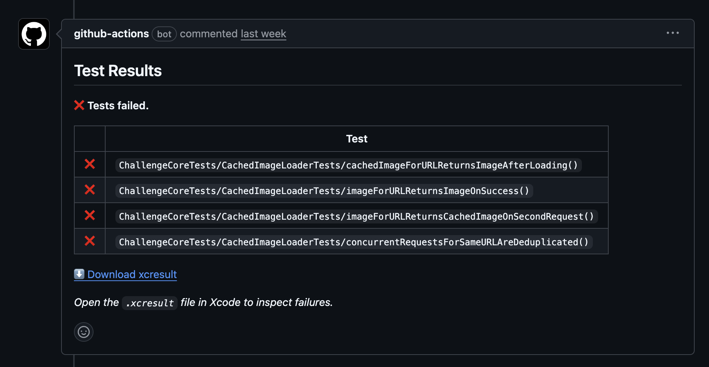
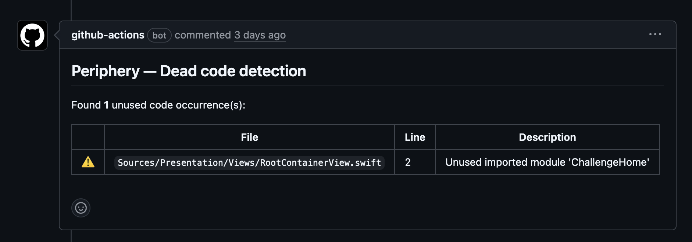

# Continuous Integration

The project uses [GitHub Actions](https://github.com/features/actions) to run quality checks on every pull request targeting `main`.

## Workflow Overview

The CI workflow (`.github/workflows/pull-request-checks.yml`) runs a single job on `macos-15` with the following steps:

| Step | Description |
|------|-------------|
| Checkout | Clone the repository |
| Select Xcode 26 | Use the latest Xcode 26.x available on the runner |
| Install mise tools | Install tuist, swiftlint, and periphery via mise (cached) |
| Install SPM dependencies | `mise x -- tuist install` (cached) |
| Generate Xcode project | `mise x -- tuist generate` |
| Run tests | `mise x -- tuist test` (includes SwiftLint as build phase, 25 min timeout) |
| Upload xcresult | On failure: uploads `test_output` as artifact preserving `.xcresult` bundle |
| Comment PR (test failure) | On failure: posts a PR comment with a download link to the `.xcresult` artifact |
| Detect dead code | `mise x -- periphery scan` (informational, never blocks CI) |
| Comment PR (Periphery) | Posts Periphery results as a PR comment |

## Test Failure Artifacts

When tests fail, the workflow:

1. **Uploads the `.xcresult` bundle** as a GitHub artifact (`test-results`), retained for 7 days
2. **Posts a PR comment** with a direct download link to the artifact

The artifact uploads the `test_output` directory (not the bundle itself) so that the `.xcresult` directory name is preserved when extracted from the zip. To inspect failures, download the artifact, extract it, and open `Challenge.xcresult` in Xcode.

Successive pushes update the same comment instead of creating duplicates.

## Periphery PR Comments

Periphery runs with `continue-on-error: true` so it never blocks the pipeline. After execution, the workflow parses the output and posts a comment on the PR with:

- A table of unused code occurrences (file, line, description)
- The full Periphery output in a collapsible section
- If no issues are found, a success message

Successive pushes update the same comment instead of creating duplicates.

## GitHub Configuration

After pushing the workflow file, configure the repository:

### 1. Workflow Permissions (required for private repos)

1. Go to **Settings** > **Actions** > **General**
2. Under **Workflow permissions**, select **Read and write permissions**
3. Save

### 2. Branch Ruleset

1. Go to **Settings** > **Rules** > **Rulesets**
2. Click **New ruleset** > **New branch ruleset**
3. Configure:

| Field | Value |
|-------|-------|
| Ruleset name | `Protect main` |
| Enforcement status | `Active` |
| Target branches | **Add a target** > **Include default branch** |

4. Enable the following rules:

| Rule | Setting |
|------|---------|
| **Restrict deletions** | Enabled |
| **Require a pull request before merging** | Enabled |
| -- Required approvals | `1` |
| -- Dismiss stale approvals on new commits | Enabled |
| -- Require conversation resolution | Enabled |
| **Require status checks to pass** | Enabled |
| -- Status check | `Build & Test` (type the name and click **+**) |
| -- Require branches to be up to date | Enabled |
| **Block force pushes** | Enabled |

5. Click **Create**

> **Note:** The `Build & Test` status check will only appear after the workflow has run at least once. Create a test PR to trigger the first execution before configuring the ruleset.

## Design Decisions

- **Single job**: All steps run in one macOS job to minimize runner overhead. macOS minutes are billed at 10x in private repos.
- **Concurrency group**: Concurrent runs on the same branch are cancelled automatically, saving CI minutes.
- **Separate steps**: Individual CI steps are used instead of a single composite command to allow `continue-on-error` on Periphery and capture its output for PR comments.
- **Test timeout**: The test step has a 25-minute timeout to prevent frozen UI tests from blocking the pipeline indefinitely.
