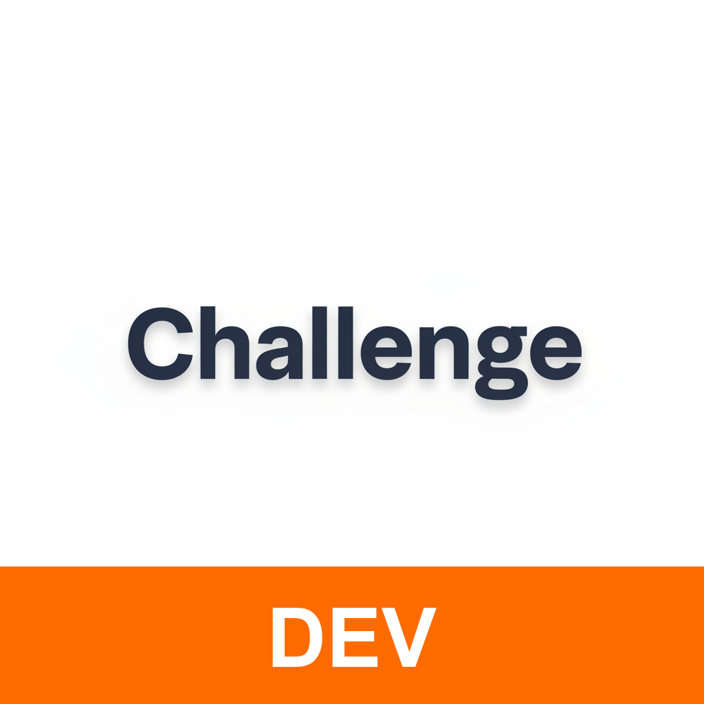
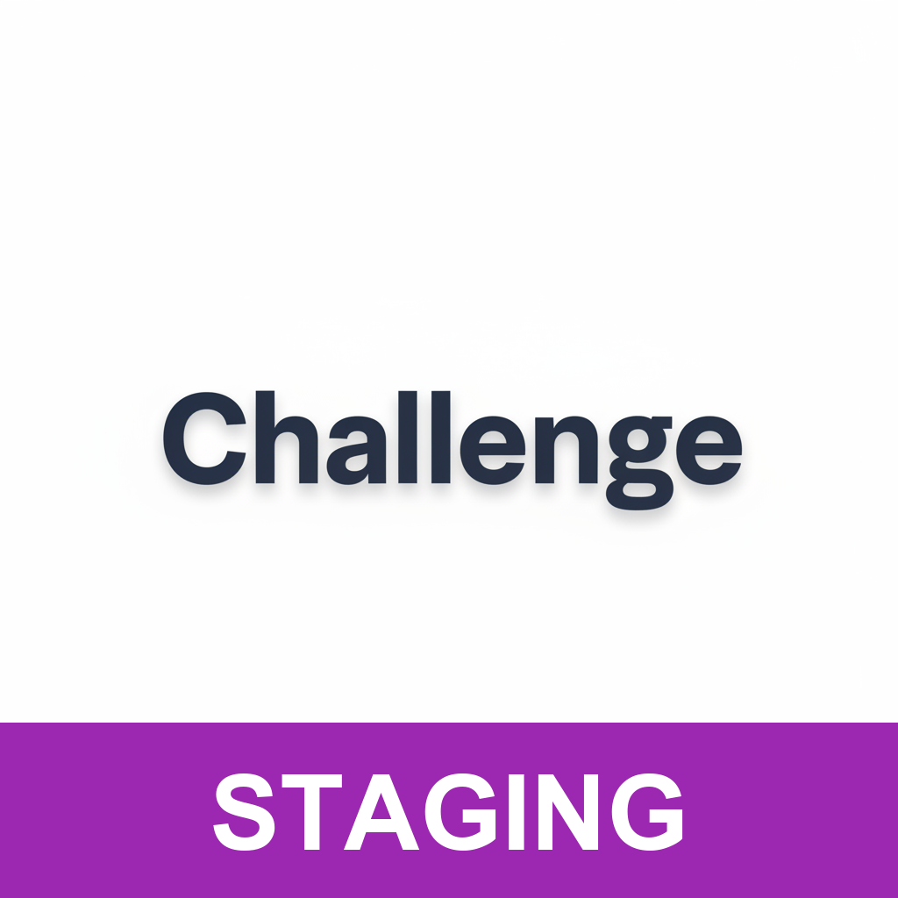

# Environments

The app supports three environments to separate development, testing, and production workflows. Each environment has its own bundle identifier, app icon, and API configuration, allowing multiple versions to be installed simultaneously on the same device.

## Overview

| Icon | Environment | Bundle ID Suffix | Scheme |
|:----:|-------------|------------------|--------|
|  | Development | `.dev` | Challenge (Dev) |
|  | Staging | `.staging` | Challenge (Staging) |
|  | Production | *(none)* | Challenge (Prod) |

### Development

Used for local development and debugging. This is the default environment when running from Xcode with the `Debug` configuration.

- **Bundle ID**: `com.company.challenge.dev`
- **Purpose**: Daily development, debugging, testing new features
- **API**: Points to development server (or mock server)

### Staging

Used for QA testing and pre-release validation. Mirrors production as closely as possible.

- **Bundle ID**: `com.company.challenge.staging`
- **Purpose**: QA testing, beta distribution, integration testing
- **API**: Points to staging server

### Production

The release version distributed to end users via the App Store.

- **Bundle ID**: `com.company.challenge`
- **Purpose**: App Store distribution
- **API**: Points to production server

## Environment Detection

The current environment is determined at compile time using Swift compilation conditions defined in [Tuist.md](Tuist.md#build-configurations).

```swift
// Libraries/Core/Sources/AppEnvironment/AppEnvironment.swift

public enum AppEnvironment {
    case development
    case staging
    case production

    public static var current: Self {
        #if DEBUG_PROD
        .production
        #elseif DEBUG_STAGING
        .staging
        #elseif DEBUG
        .development
        #elseif STAGING
        .staging
        #else
        .production
        #endif
    }
}
```

### Usage

```swift
// Check current environment
if AppEnvironment.current == .development {
    // Development-only code
}

// Use environment-specific configuration
let apiURL = AppEnvironment.current.rickAndMorty.baseURL
```

## API Configuration

Each environment can have its own API base URL. The configuration is defined in `AppKit/Sources/Data/AppEnvironment+API.swift`.

```swift
extension AppEnvironment {
    public var rickAndMorty: API {
        let urlString: String = switch self {
        case .development:
            "https://dev-api.example.com/api"
        case .staging:
            "https://staging-api.example.com/api"
        case .production:
            "https://api.example.com/api"
        }
        return API(baseURL: URL(string: urlString)!)
    }
}
```

### Environment Variable Override

For UI testing with a mock server, the API URL can be overridden using the `API_BASE_URL` environment variable:

```swift
if let overrideURL = ProcessInfo.processInfo.environment["API_BASE_URL"] {
    // Use override URL instead of environment-specific URL
}
```

## Build Configurations

Each environment maps to specific build configurations. See [Tuist.md](Tuist.md#build-configurations) for the full configuration matrix.

| Configuration | Environment | Type | Use Case |
|---------------|-------------|------|----------|
| Debug | Development | Debug | Local development |
| Debug-Staging | Staging | Debug | Debugging staging issues |
| Debug-Prod | Production | Debug | Debugging production issues |
| Staging | Staging | Release | QA / Beta distribution |
| Release | Production | Release | App Store |
