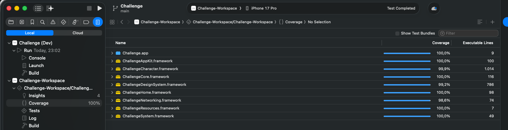

# Testing

## Test Types

| Type | Framework | Location |
|------|-----------|----------|
| Unit Tests | Swift Testing | `*/Tests/Unit/` |
| Snapshot Tests | ChallengeSnapshotTestKit | `*/Tests/Snapshots/` |
| UI Tests | XCTest | `App/Tests/UI/` |

## Test Structure

Tests follow Given/When/Then structure:

```swift
@Test("Fetches characters from repository")
func fetchesCharacters() async throws {
    // Given
    let sut = GetCharactersPageUseCase(repository: repositoryMock)

    // When
    let result = try await sut.execute(page: 1)

    // Then
    #expect(result.characters.count == 2)
}
```

## Test Doubles

The project uses **Mocks** to isolate units under test. Mocks are located in:

| Location | Scope | Purpose |
|----------|-------|---------|
| `Libraries/Core/Mocks/` | Public | Shared mocks for Core protocols |
| `Libraries/Networking/Mocks/` | Public | Shared mocks for Networking protocols |
| `*/Tests/Shared/Mocks/` | Internal | Module-specific test mocks |

### Example Mock

```swift
final class CharactersPageRepositoryMock: CharactersPageRepositoryContract, @unchecked Sendable {
    var charactersResult: Result<CharactersPage, CharactersPageError> = .failure(.loadFailed)

    func getCharactersPage(page: Int, cachePolicy: CachePolicy) async throws(CharactersPageError) -> CharactersPage {
        try charactersResult.get()
    }

    func searchCharactersPage(page: Int, filter: CharacterFilter) async throws(CharactersPageError) -> CharactersPage {
        try charactersResult.get()
    }
}
```

### Test Data

| Location | Purpose |
|----------|---------|
| `*/Tests/Shared/Stubs/` | Domain model test data (`.stub()` extensions) |
| `*/Tests/Shared/Fixtures/` | JSON files for DTO testing |

## UI Tests

UI tests use [SwiftMockServer](https://github.com/vjr2005/SwiftMockServer) to run a local HTTP mock server. The `UITestCase` base class manages the server lifecycle and passes the base URL to the app via the `API_BASE_URL` environment variable.

### Scenarios

Mock server configurations are extracted into reusable methods on `UITestCase`:

| Type | Purpose | Example |
|------|---------|---------|
| **Initial** | Configure all routes before `launch()` | `givenCharacterListSucceeds()` |
| **Recovery** | Override specific routes mid-test for retry flows | `givenCharacterListRecovers()` |

Scenarios live in `App/Tests/Shared/Scenarios/UITestCase+Scenarios.swift`. See the `/ui-tests` skill for the full list and implementation details.

### Robot Pattern

Each screen has a Robot struct that encapsulates UI interactions and verifications:

```swift
@MainActor
func testNavigationFlow() async throws {
    // Given
    try await givenCharacterListAndDetailSucceeds()

    // When
    launch()

    // Then
    characterList { robot in
        robot.verifyIsVisible()
        robot.tapCharacter(identifier: 1)
    }
}
```

See the `/ui-tests` skill for Robot implementation details.

## Test Parallelization

The project uses a **three-level parallelization strategy** to optimize test execution:

| Level | Mechanism | Status | Impact |
|-------|-----------|--------|--------|
| **Intra-target** | Swift Testing runs tests in parallel within each target | Active (`.swiftTestingOnly`) | Moderate — free parallelism within each target |
| **Inter-target** | Xcode clones simulators and distributes targets | Disabled | Negative at current volume (see benchmark below) |
| **CI-level** | Unit+snapshot and UI tests run in parallel GitHub Actions jobs | Active | **High** — total CI time = `max(unit+snapshot, UI)` instead of `sum()` |

### Intra-target Parallelism

All test targets use `parallelization: .swiftTestingOnly` in their Tuist scheme configuration. This allows Swift Testing to run tests in parallel within each target while keeping XCTest-based tests (snapshot tests) serial.

To support safe parallel execution:
- **`HTTPClientTests`** uses unique hosts per test (e.g., `test-builds-url.example.com`) to prevent `URLProtocolMock` handler collisions.
- **`CachedImageLoaderTests`** uses unique hosts per test — no `.serialized` trait needed.
- **`CharacterListViewModelTests`** accepts an injectable `debounceInterval` (set to `.zero` in tests) to eliminate timing sensitivity.

### Inter-target Benchmark

A benchmark study found inter-target parallelization (simulator cloning) is **~49% slower** for the current test volume:

| Test Type | Serial | Parallel | Change |
|-----------|--------|----------|--------|
| Unit + Snapshot | 0:36 | 0:56 | +55.6% slower |
| UI Tests | 2:17 | 3:21 | +46.7% slower |
| **Total** | **2:53** | **4:17** | **+48.6% slower** |

> Measured on iPhone 17 Pro simulator, Tuist 4.129.0 (February 2026).

**Why inter-target parallelization is slower:**

- **Unit + Snapshot Tests:** 12 test targets compete for CPU/GPU when running concurrently on a cloned simulator. Simulator cloning overhead, cold caches, and rendering contention nearly double the time.
- **UI Tests:** Xcode distributes by class, using 4 clones. Booting each clone (~15s) costs more than it saves with only 8 tests.

### When to Re-evaluate Inter-target

- When unit/snapshot test execution exceeds **60-90s of real test time**
- When UI tests exceed **15-20 classes** to amortize simulator boot overhead
- When migrating to CI with more powerful runners (more CPU = less relative overhead)

## Troubleshooting

### Corrupted Simulator State

If UI tests fail with `Simulator device failed to launch` or `LaunchServicesDataMismatch` errors, the simulator data is likely corrupted. This typically manifests as apps crashing immediately after launch or tests timing out unexpectedly.

Run the reset script and restart Xcode:

```bash
./reset-simulators.sh
```

See [Scripts](Scripts.md#reset-simulators-script) for details.

## Coverage

The project achieves **100% code coverage** across all modules.



### Coverage Policy

- All production code must be tested
- Only source targets are measured (mocks and test helpers are excluded)
- Coverage is enforced in CI pipeline
