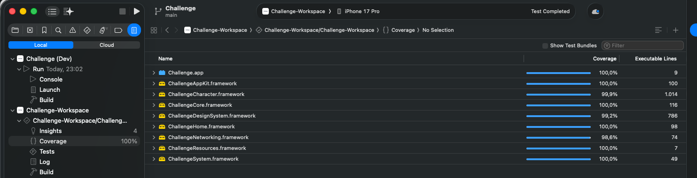

# Testing

## Test Types

| Type | Framework | Location |
|------|-----------|----------|
| Unit Tests | Swift Testing | `*/Tests/Unit/` |
| Snapshot Tests | SnapshotTesting | `*/Tests/Snapshots/` |
| UI Tests | XCTest | `App/Tests/UI/` |

## Test Structure

Tests follow Given/When/Then structure:

```swift
@Test("Fetches characters from repository")
func fetchesCharacters() async throws {
    // Given
    let sut = GetCharactersUseCase(repository: repositoryMock)

    // When
    let result = try await sut.execute(page: 1)

    // Then
    #expect(result.characters.count == 2)
}
```

## Test Doubles

The project uses **Mocks** to isolate units under test. Mocks are located in:

| Location | Scope | Purpose |
|----------|-------|---------|
| `Libraries/Core/Mocks/` | Public | Shared mocks for Core protocols |
| `Libraries/Networking/Mocks/` | Public | Shared mocks for Networking protocols |
| `*/Tests/Shared/Mocks/` | Internal | Module-specific test mocks |

### Example Mock

```swift
final class CharacterRepositoryMock: CharacterRepositoryContract {
    var getCharactersResult: Result<CharacterPage, Error> = .success(.stub())

    func getCharacters(page: Int) async throws -> CharacterPage {
        try getCharactersResult.get()
    }
}
```

### Test Data

| Location | Purpose |
|----------|---------|
| `*/Tests/Shared/Stubs/` | Domain model test data (`.stub()` extensions) |
| `*/Tests/Shared/Fixtures/` | JSON files for DTO testing |

## UI Tests

UI tests use a local HTTP stub server ([Swifter](https://github.com/httpswift/swifter)) to mock API responses.

### StubServer

The `UITestCase` base class automatically manages the stub server lifecycle:

```swift
final class CharacterFlowUITests: UITestCase {
    @MainActor
    func testCharacterFlow() throws {
        // Configure mock responses
        stubServer.requestHandler = { path in
            if path.contains("/character") {
                return .ok(Data.fixture("characters_response"))
            }
            return .notFound
        }

        // Launch app (automatically uses stub server URL)
        launch()

        // Test with robots
        characterList { robot in
            robot.verifyIsVisible()
        }
    }
}
```

### StubResponse API

| Method | Description |
|--------|-------------|
| `.ok(Data)` | 200 with JSON body |
| `.image(Data)` | 200 with image/jpeg content type |
| `.error(Int, message:)` | Custom status code with error JSON |
| `.notFound` | 404 Not Found |
| `.serverError` | 500 Internal Server Error |

## Coverage

The project achieves **100% code coverage** across all modules.



### Coverage Policy

- All production code must be tested
- Only source targets are measured (mocks and test helpers are excluded)
- Coverage is enforced in CI pipeline
